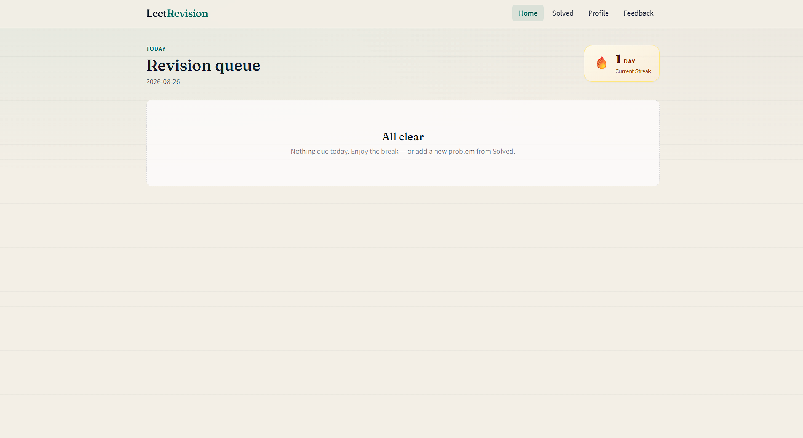
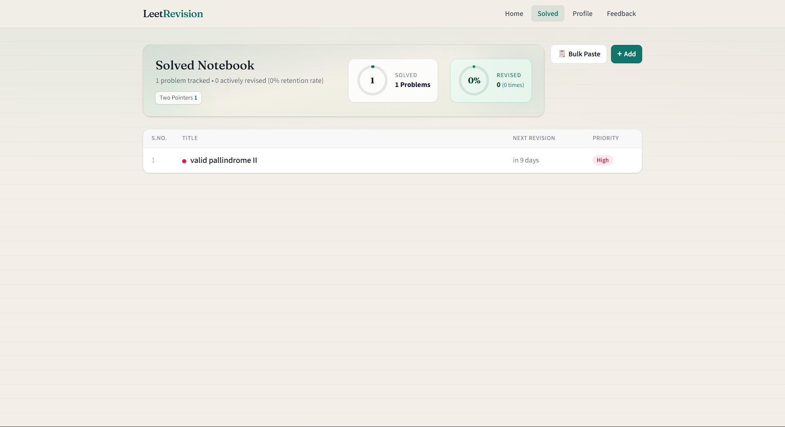
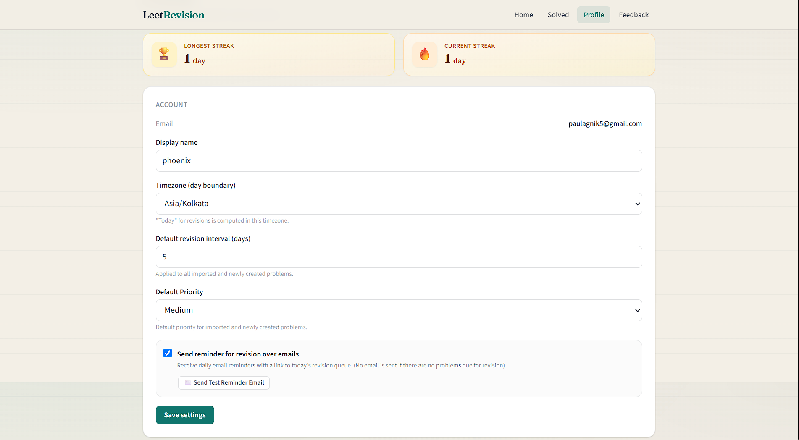
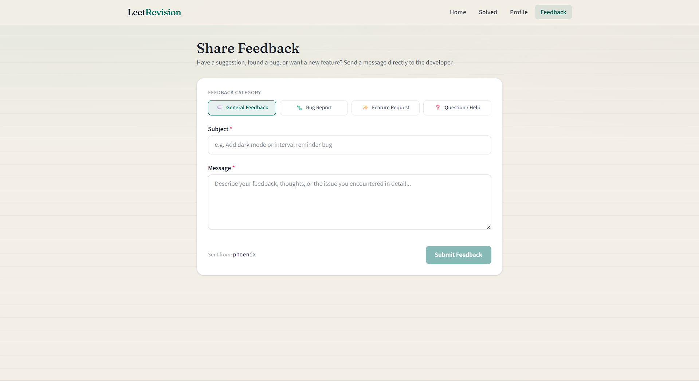

# LeetRev

A spaced repetition and revision tracking application for coding problems (e.g., LeetCode), helping you remember and practice effectively through automated reminders and scheduled revisions.

## Demo / Live Preview
- **Live Website:** https://leetrevision.approjects.me/
- **Demo Video:** [Add link or gif here]

## Features
- **Revision Tracking:** Keep track of coding problems you have solved.
- **Spaced Repetition:** Smart scheduling algorithm to determine when you should revise a problem next.
- **Automated Reminders:** Receive notifications or emails for problems that are due for revision.
- **Problem Management:** Add, edit, and prioritize your solved problems easily.
- **Leetcode Integration:** Fetch solved problems from LeetCode and add them to your revision tracker.
**Everyday tracker :** uses everyday streak to motivate the user

## Tech Stack
- **Languages:** TypeScript, SQL
- **Frameworks/Libraries:** Next.js (App Router), React, Tailwind CSS, React Query
- **Database:** Supabase (PostgreSQL)
- **APIs/Services:** Supabase Auth, Next.js Serverless Functions
- **Deployment Platform:** Vercel 

## Screenshots
1.Landing Page which shows all your revision queues.

2.List of all solved problems that are manually added or fetched from Leetcode.

3.User profile

4.Feedback

## Installation & Setup
To run this project locally, follow these steps:

1. **Clone the repository:**
   ```bash
   git clone https://github.com/yourusername/leet.git
   cd leet
   ```

2. **Install dependencies:**
   ```bash
   npm install
   ```

3. **Environment variables:**
   Create a `.env.local` file in the root directory and add the following variables based on your Supabase project:
   ```env
   NEXT_PUBLIC_SUPABASE_URL=your_supabase_url
   NEXT_PUBLIC_SUPABASE_ANON_KEY=your_supabase_anon_key
   SUPABASE_SERVICE_ROLE_KEY=your_supabase_service_role_key
   ```
   

4. **Run database migrations:**
   Apply the provided Supabase migrations in the `supabase/migrations` folder to your local or remote database.

5. **Start the development server:**
   ```bash
   npm run dev
   ```

## Usage
1. Open your browser and navigate to `http://localhost:3000`.
2. Sign up or log in using the authentication system.
3. Add a new problem you've recently solved.
4. Check the dashboard to see problems scheduled for today's revision.
5. After revising a problem, update its status to schedule the next optimal revision date.

## Project Structure
- `src/app/`: Next.js App Router pages and API routes (e.g., reminders API).
- `src/components/`: Reusable React components (e.g., `RevisionRow.tsx`).
- `src/lib/`: Utility functions, scheduling logic, and shared code.
- `supabase/migrations/`: SQL migration files for database schema setup (e.g., `010_default_priority.sql`).

## API Documentation
The application exposes serverless API endpoints primarily for background jobs.
- `POST /api/reminders/send`: Triggers the sending of automated reminders to users for problems due for revision. Used by cron jobs or external schedulers.

## Environment Variables
The following environment variables are required to run the application securely:
- `NEXT_PUBLIC_SUPABASE_URL`: The URL of your Supabase instance, required for client-side queries.
- `NEXT_PUBLIC_SUPABASE_ANON_KEY`: The public anonymous key for Supabase, safe to expose in the client for RLS-protected queries.
- `SUPABASE_SERVICE_ROLE_KEY`: Admin key for Supabase used purely in secure server-side environments (e.g., triggering reminders). **Do not expose to the client.**

## License
MIT License

## Author / Contact
- **Name:** [Agnik Paul]
- **GitHub:** [https://github.com/draxter002]
- **LinkedIn:** [https://www.linkedin.com/in/agnik-paul/]
- **Portfolio:** [https://approjects.me/]
